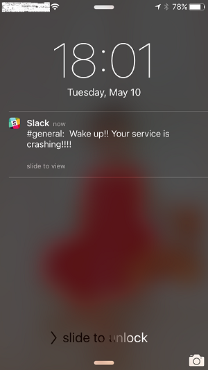

Instant Notification
====

`instant-notification` is a service that helps local applications to send
channel-based notification. Currently it can send notification to Slack. In
order to use this program, you need a Slack team, set up a [bot][1], and obtain
its access token.

To install:

    npm install -g instant-notification

To run:

    >> instant --slack-token=xxxx-xxxxxxxxxxxxxxxxxxx --port=10007
    Server listening at {"address":"::","family":"IPv6","port":10007}

Then in any program, send a notification is simply connecting to this TCP
endpoint and send messages in the form of:

    <channel> <message>

`channel` must already exist on your Slack team. It cannot contain spaces.
`message` can have any characters including spaces.

One easy way to test is by using `netcat`:

    >> ncat localhost 10007
    general Wake up!! Your service is crashing!!!!

And here's what you'll get on your phone:

Usage
----

    instant [--debug] [--port=[10007]] [--slack-token=<token>]
    [--username=<username>]
       If slack token is not specified, it must be present as the environment
       variable SLACK_TOKEN

[1]: https://api.slack.com/bot-users
